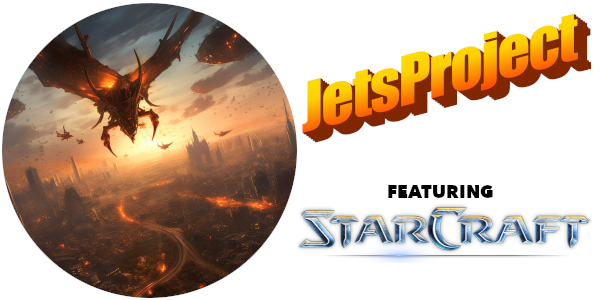

# JetsProject

Week 3 homework by Justin Martz
## Description

<strong>StarCraftApp</strong> loads data from a file of different <strong>StarCraft</strong> units and adds them to a fleet (<code>addToFleet(List&lt;StarCraft&gt; list)</code>). A basic <strong>StarCraftImpl</strong> implementation is given with no interface. Also given are types <strong>ZergAirUnit</strong>, <strong>TerranAirUnit</strong>, and <strong>ProtossAirUnit</strong>, which implement interfaces unique to their species. 
The user is then presented with a menu of options to choose from. Depending on the option, the user can view all units in the fleet (<code>listFleet()</code>), view specific computations of a value (<code>viewFastest()</code>, <code>viewLongestRange()</code>), call specialized behavior on each type (<code>healAllZerg()</code>, <code>firePowerfulWeapons()</code>, <code>teleportProtoss()</code>, add units to or remove units from the fleet (<code>addToFleet(StarCraft newUnit)</code>, <code>removeFromFleet(String name)</code>), and exit the program.

## Technologies Used

- Java

- Eclipse

## Lessons Learned

I used Oracle docs to reference Java library methods more than I ever have so far. I also referenced my own notes a lot for this assignment as well as the Friday Zoom recording. I'm learning to become more familiar with these resources.
 
I feel comfortable using the <code>super()</code> constructor with arguments in my subclasses now. At first I tried to call <code>super()</code> with no arguments and no fields were getting filled, so remembering how to figure it out for an assignment made it stick.

The stretch goal taking either an <code>int</code> or a <code>string</code> to remove a unit from the fleet was tough. I wanted to use if/else statements for my logic but couldn't figure it out so I used a try/catch instead.
